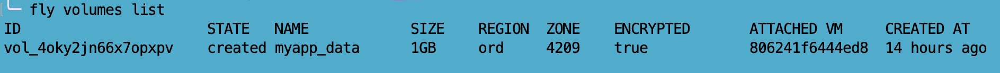
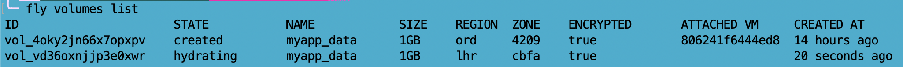
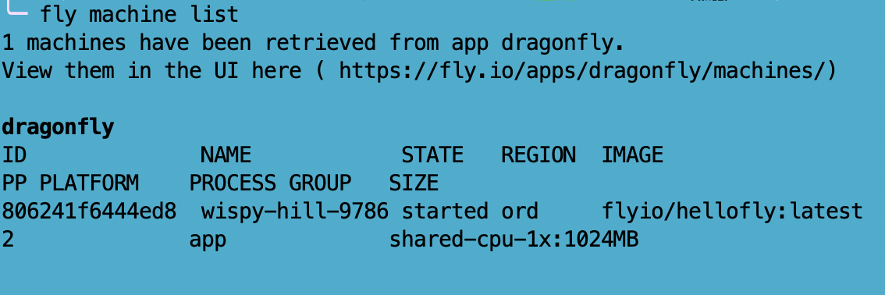

# Move a Fly App from one region to another <!-- omit in toc -->

One of the features of Fly.io that developers love most is the number of regions they can host their app in. However, say you started building your app in one place, but your users end up being located somewhere else. Or say you've simply developed a beef with the region you started out in. In either of these cases, you'll want to move your app over to a new region. This guide will show you how to move your fly app's machine and the machine's associated volume from one region to another with an example of an app being moved from Chicago (ORD) to London (LHR).

Essentially, we're just copying the existing machine and volume into a new region and deleting the ones in the original region. Here are the steps:

- [Clone the volume](#clone-the-volume)
  - [Obtain volume ID](#obtain-volume-id)
  - [Obtain region code](#obtain-region-code)
  - [Cloning the volume](#cloning-the-volume)
- [Clone the machine and attach the volume to the machine](#clone-the-machine-and-attach-the-volume-to-the-machine)
  - [Obtain Machine ID](#obtain-machine-id)
  - [Obtain Volume ID for your newly created volume](#obtain-volume-id-for-your-newly-created-volume)
  - [Cloning the Machine and attaching the volume](#cloning-the-machine-and-attaching-the-volume)
- [Modify your configuration file to reflect your new primary region](#modify-your-configuration-file-to-reflect-your-new-primary-region)
- [Destroy the old machine and volume](#destroy-the-old-machine-and-volume)
  - [Destroy the old machine](#destroy-the-old-machine)
  - [Destroy the old volume](#destroy-the-old-volume)

Note: this guide assumes that you already have one machine and one volume up and running

## Clone the volume

This step and step two are also covered in the manage volume storage page in the [create a copy of a volume section](https://fly.io/docs/apps/volume-manage/#create-a-copy-of-a-volume-fork-a-volume).

Parts you will need:

- Volume ID
- Three letter region code of your desired region

### Obtain volume ID 

Run the following command:

`fly volumes list`

[Relevant flyctl documentation](https://fly.io/docs/flyctl/volumes-list/)

This gives an output like the following:

Copy the first value, the ID that starts with vol. In the example project case, the ID is `vol_4oky2jn66x7opxpv`.

### Obtain region code

You can do one of two things. You can either:

- Visit [this page](https://fly.io/docs/reference/regions/) that lists all the regions and their corresponding codes
- Run `fly platform regions` to get a list of regions

### Cloning the volume

Now that you have all the parts you need, it's time to run the command to clone the volume! Run the following:

`fly volumes fork <volume ID> --region <region>`

In the example project, the command is the following:

`fly volumes fork vol_4oky2jn66x7opxpv --region lhr`

Now if you run `fly volumes list`, you will see that two volumes are now listed, the original one in your original region, and a new one in the target region.

In the example project, the output of `fly volumes list` would look like the following:

## Clone the machine and attach the volume to the machine

Parts you will need:

- Machine ID
- Volume ID for your newly created volume

### Obtain Machine ID

Run the following command:

`fly machines list`

This should give you an output that looks like the following example:

Copy the first value, the ID number for the machine. In the example case, this is`806241f6444ed8`.

### Obtain Volume ID for your newly created volume

Run `fly volumes list` and grab the ID for the volume in your target region.

In the example below, the volume ID needed for this step would be `vol_vd36oxnjjp3e0xwr`, as it is the one listed with its region in LHR.

### Cloning the Machine and attaching the volume

Take the machine ID and new volume ID we got in the above steps and run the following command. This will clone your machine in your original region and make a new copy in your target region, and it attaches the volume you have already created above.

`fly machine clone <machine id> -r <region code> --attach-volume <volume id>:<destination mount path>`

Note: the destination mount path is the path that your newly created volume will be mounted in the new machine that is created by this command. In the example project, that path is `/data` but this may change depending on your own app's configurations.

In the example project, the command would look like the following:

`fly machine clone 806241f6444ed8 -r lhr --attach-volume vol_vd36oxnjjp3e0xwr:/data`

At this point, you should have two machines (one in the original location and one in the target location) and one volume attached to each machine.

## Modify your configuration file to reflect your new primary region

When your app deploys, there is a `fly.toml` file that is generated in your project source directory. This is what you use to adjust configurations for your app. For more information, see the [fly launch configuration documentation](https://fly.io/docs/reference/configuration). One parameter that is listed is the [primary region](https://fly.io/docs/reference/configuration/#primary-region). Edit that primary region parameter so it's your target region. 

In the example project, this parameter originally said ORD and would be changed to LHR. 

After you save this file, run `fly deploy` to push these changes.

## Destroy the old machine and volume

Note: You must destroy the machine before you can destroy the volume.

### Destroy the old machine

Parts needed:

- Machine ID of the machine to be deleted (see [obtain machine ID](#obtain-machine-id))

Run the following command:

`fly machine destroy [flags] ID ID ...`

In the example project, the command ran was the following:

`fly machine destroy 806241f6444ed8`

[Flyctl documentation about fly machine destroy](https://fly.io/docs/flyctl/machine-destroy/)

### Destroy the old volume

Parts needed:

- Volume ID of the machine to be deleted (see [obtain volume ID](#obtain-volume-id))

Run the following command:

`fly volumes destroy [flags] ID ID ...`

In the example project, the command ran was the following:

`fly volumes destroy vol_4oky2jn66x7opxpv`

[Flyctl documentation about fly volume destroy](https://fly.io/docs/flyctl/volume-destroy/)

Now, if you run `fly volumes list`, you'll see that this volume no longer exists and if you run `fly machines list` you'll see that the machine in your original area no longer exists as well. Remember, you can have machines in multiple regions that start and stop as needed (read more about how you can use your `fly.toml` file to configure automatically starting and stopping machines [here](https://fly.io/docs/apps/autostart-stop/)). If you decide that your beef with your original region is not as insurmountable as you initially thought, you can forgo the last step and use the linked auto-start and stop guide and the guide for [scaling your app's regions](https://fly.io/docs/apps/scale-count/#scale-an-apps-regions) to efficiently configure your app for multiple regions. If you created an app using the `fly launch` command, auto_start and auto_stop are automatically configured to be true.

A note if you decide to let your app have machines in multiple regions: If only one machine is necessary to run your app, the machine in the primary region will be the only one to run. So your `fly.toml` file should be configured so that the majority of your users are in the primary region, even if you have machines in multiple regions.